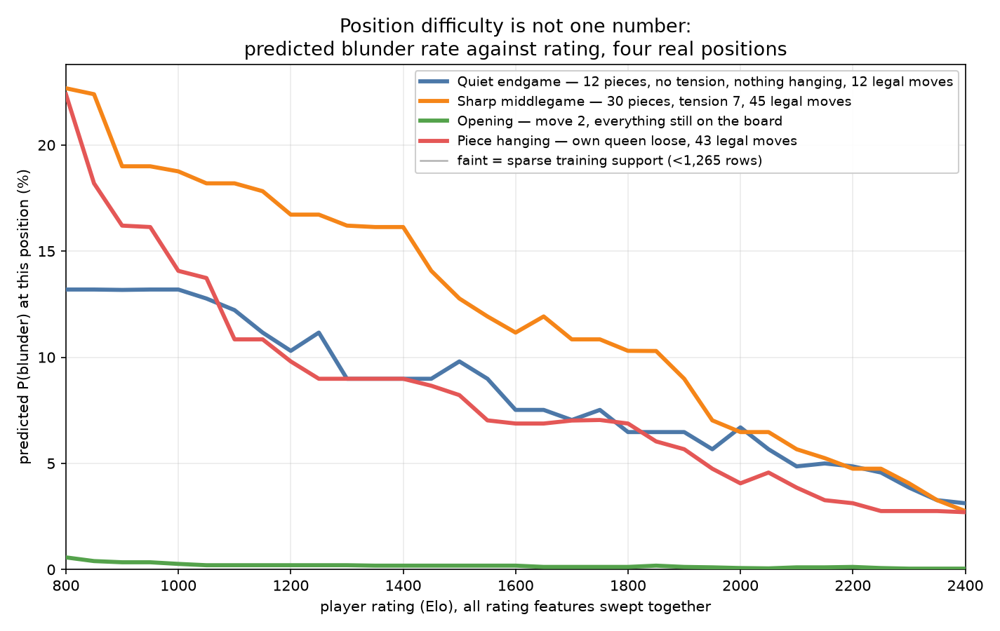
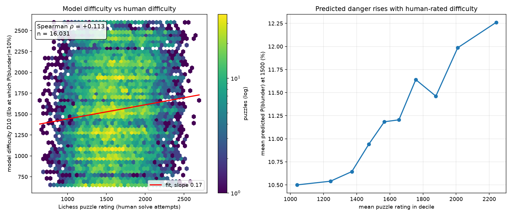

# Chess Blunder Predictor

A model of human error: P(blunder | position, rating). It is not an engine.
The output is a calibrated probability, like "a 1400 blunders here 23% of the
time, a 2000 blunders 4%", and the calibration holds inside each rating band
rather than only on average.

Built on one full month of Lichess blitz. 86.5M games scanned, 6.68M evaluated
positions, 1.26M held-out test rows.



Four real positions from the dataset. The sharp middlegame stays dangerous even
for strong players, the hanging piece stops being dangerous once you are past
about 1400, and the opening is safe for everybody. One number cannot describe
position difficulty.

---

## The main result

Stronger players do not get easier positions. They get the same positions and
pick better moves out of them.

To measure that, every legal move in 150,000 positions went through Stockfish
(about 4.6M child evaluations) so that "how many of the available moves are
blunders" becomes a number rather than an intuition. Splitting the rating
effect into two channels:

| channel | share of the rating effect | 95% CI |
|---|---:|---|
| availability, do weak players face more dangerous positions | -0.7% | [-1.9%, +0.4%] |
| selection, do they pick the bad moves more often | +100.7% | |

The fraction of legal moves that lose 20 win% or more is flat across 800 Elo
points: 38.4% at the bottom against 38.6% at the top. It is flat at every
quantile too, not just at the mean. What changes is how often a human picks
one of them.

| rating | P(blunder) | share of moves that blunder | better than random |
|---|---:|---:|---:|
| under 1200 | 7.19% | 38.4% | 5.3x |
| 1200-1600 | 5.14% | 38.4% | 7.5x |
| 1600-2000 | 3.88% | 38.6% | 9.9x |
| 2000+ | 2.59% | 38.6% | 14.9x |

The confidence interval is 2.3 points wide and contains zero, so this is a
tight null rather than a failure to measure anything. The data rules out an
availability effect bigger than a couple of points.

---

## How well the model does

Test set of 1,257,458 rows, base rate 3.909%, split so that no player appears
on both sides.

| model | Brier skill | PR-AUC | PR lift | ROC-AUC | ECE |
|---|---:|---:|---:|---:|---:|
| constant baseline | +0.0000 | 0.0391 | 1.00x | 0.500 | |
| rating only | +0.0037 | 0.0536 | 1.37x | 0.587 | 0.0012 |
| engine_free, 56 features, no engine needed | +0.0496 | 0.1258 | 3.22x | 0.792 | 0.0012 |
| engine_assisted, adds a Stockfish eval | +0.1238 | 0.2389 | 6.11x | 0.871 | 0.0010 |

engine_free is 13.4x better than knowing the rating alone. Adding an engine
roughly doubles it again, 2.30x on the eligible subset, which is the fair
comparison for reasons covered under the structural floor below.

Accuracy is never reported anywhere in this project. At a 3.9% base rate you
score 96% by predicting "no blunder" every time.

### Calibration inside each rating band

| band | rows | observed | predicted | ECE |
|---|---:|---:|---:|---:|
| under 1200 | 172,939 | 5.94% | 6.11% | 0.0027 |
| 1200-1600 | 352,209 | 4.52% | 4.62% | 0.0015 |
| 1600-2000 | 385,198 | 3.66% | 3.65% | 0.0009 |
| 2000+ | 347,112 | 2.54% | 2.56% | 0.0011 |

Overall calibration can look fine by accident, because over-predicting weak
players cancels out under-predicting strong ones. That is not happening here,
which is what makes the "a 1400 blunders here 23% of the time" claim usable
instead of just a nice sentence.

Calibration came out of the box. LightGBM with `is_unbalance=False` was already
calibrated and the isotonic step moves ECE by about 0.0001.

### What it cannot do

The top predicted decile hits 13.9% observed against a 3.9% base rate for
engine_free (3.5x) and 21.1% for engine_assisted (5.4x). So this finds
dangerous positions, it does not catch individual blunders. Anyone using it
should treat it as a difficulty signal.

---

## Other things that came out of it

**Time pressure barely matters.** Dropping every clock feature costs
engine_free 1.4% of its Brier skill and costs engine_assisted nothing at all
(+0.0496 to +0.0489, and +0.1238 to +0.1241). `move_number` picks up the slack,
going from 9.59% to 11.83% of the gain as a stand-in for elapsed time, while
`mover_elo` does not move. The original guess was that time trouble would
dominate. It does not. Rating predicts blunders about as well with the clock
removed.

**Player leakage turned out to be nothing.** Retrained end to end on a naive
game-hash split: +0.0496 with player-disjoint splits against +0.0499 with the
naive one, ROC-AUC 0.7920 against 0.7910. No gap, because players only recur
1.45 times in this dataset, so there is nothing about a player to memorise. The
player-disjoint split stays anyway. It costs nothing and would matter on a
denser graph.

**External validation is positive but weak.** Tested against 20,000 Lichess
puzzles whose difficulty ratings come from real solve attempts and were never
part of training:



Spearman +0.113 across 16,031 uncensored puzzles, rising across 8 of 9 deciles,
every theme positive. That is about 14 standard errors from zero, and well
short of the 0.4 to 0.6 that would have counted as a real success. The
interesting part is the compression: the model's difficulty scale moves 186 Elo
while the human scale under it moves 1,202. It gets the ordering roughly right
and badly understates the range.

The likely reason lines up with the main result. Puzzles are picked so that a
blunder is always available, which pins the availability channel by
construction and leaves only selection. That is a hypothesis, not something
this repo has tested.

---

## Try it

An interactive board where every legal move was scored by Stockfish ahead of
time, so the page knows what any move is worth without an engine, a server or
any JavaScript dependencies.

```bash
python -m http.server -d docs 8000   # then open localhost:8000/challenge.html
```

Play a move and it tells you what it cost, what the best move was, and what the
model expected from a player of your rating. After ten positions it reports the
rating whose predicted blunder rate matches yours.

---

## Method, and the parts that caused trouble

**The label.** `blunder = (win% before - win% after) > 20` from the mover's
side, where `win% = 50 + 50 * (2/(1 + exp(-0.00368208 * cp)) - 1)` and `cp` is
clamped to +/-1000. Positions where either side of the move is a forced mate
score are dropped, which is 6.1% of rows.

**The structural floor, which is a real blind spot.** Because `cp` is clamped,
win% is clamped to [2.46, 97.54], so a 20 point drop is arithmetically
impossible once `winpct_before` is at or below 22.46 (`cp < -337`). That means
12.5% of rows can never register a blunder, and they contain exactly zero,
which is a useful check that the arithmetic is right. Dropping a rook while
already down a queen does not count. Every engine comparison is therefore also
reported on the eligible subset where that free win disappears.

**Splitting by player, not by position.** Positions from one game share a
player, an opening and a clock situation, so a random split leaks all three.
Connected components of the player co-occurrence graph get assigned whole. A
naive game-hash split leaks 19.0% of its test players into training.

**Columns that are never features:** anything only knowable after the move.
`cp_after`, `winpct_after`, `win_drop`, `clk_after`, `result`, and the time
spent on the current move, since that is chosen at the same time as the move
itself. Time spent on earlier moves is fine.

**Metrics.** Log loss, Brier skill against the base rate, PR-AUC against the
positive rate, ECE, and reliability diagrams within rating bands. ROC-AUC is
reported but never on its own, since it is invariant to class balance and a
good value sits happily next to terrible precision at this base rate.

---

## Limitations

- The label is blind in already-lost positions, as described above.
- The annotated games are not a random sample. Lichess analysis is opt-in, and
  these players sit about 135 Elo above the pool median with a 1.5x wider
  spread. Any claim about 900-rated blitz rests on thinner evidence than the
  row count suggests.
- The selection ratio is measured against random play, because
  `frac_blunder_moves` is exactly what picking a legal move at random would
  score. Humans do not pick uniformly, so "14.9x better than random" is a
  benchmark, not a claim about how people search. A human-policy baseline like
  Maia would be the right denominator and is not in scope here.
- External validation is weak (+0.113) and the explanation for why has not been
  tested.
- Blitz only. Blitz and rapid are separate Glicko2 pools, so a 1500 in one is
  not a 1500 in the other and they are never mixed. Rapid is parsed but not
  modelled.
- 30.5% of positives sit within 5 win% of the threshold. That is label noise
  and it caps what any model can score here.

---

## Running it

```bash
python src/status.py     # reads the filesystem and prints the next command
```

Every script takes explicit `--data` and `--out` paths and hardcodes no
filenames.

| step | script | time |
|---|---|---|
| parse the 28 GB dump into positions | `parse_lichess.py` | 20-35 min |
| validate the label | `verify_labels.py` | 2 min |
| positions to features | `build_features.py` | ~90 min |
| player-disjoint folds | `make_splits.py` | 1-4 min |
| baselines | `baselines.py` | 2 min |
| train four variants | `train.py` | 5 min each |
| evaluate and plot | `evaluate.py` | 5 min |
| Stockfish over every legal move | `eval_children.py` | 2-3 h |
| availability against selection | `decompose.py` | 3 min |
| difficulty curves | `difficulty_curves.py` | 2 min |
| external validation | `validate_puzzles.py` | 5 min |
| the interactive demo | `build_challenge.py` | 1 min |

Two scripts self-test without needing any data:

```bash
python src/decompose.py --self-test        # planted-split recovery, 25 seeds
python src/build_features.py --self-test   # the rating sweep and its guard
```

[FINDINGS.md](FINDINGS.md) is the running log of what the data actually turned
out to be, including the bugs, the dead ends, and the things that looked broken
and were not. Every number above comes from there. [SPEC.md](SPEC.md) has the
invariants.

## Layout

```
src/       scripts                 data/     parquet (gitignored)
figures/   plots                   models/   boosters (gitignored)
metrics/   json for every number   reports/  validation output
docs/      the playable demo
```
